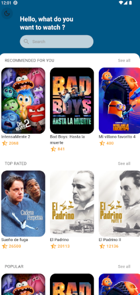

# app_cinemapedia

**app_cinemapedia** es una aplicación móvil desarrollada con Flutter que permite a los usuarios explorar y descubrir películas, ver detalles, y gestionar sus listas de favoritos. La aplicación está integrada con The Movie Database (TMDb) para obtener información actualizada sobre películas.

## Características

- **Pantalla de inicio:** Presenta una selección de películas en diferentes categorías como populares, mejor valoradas, próximas y en cartelera.
- **Detalles de la película:** Muestra información detallada sobre cada película, incluyendo sinopsis, calificaciones, elenco, y más.
- **Búsqueda:** Permite a los usuarios buscar películas por título.
- **Favoritos:** Los usuarios pueden agregar películas a su lista de favoritos.
- **Modos de tema:** Soporta modos claro y oscuro para mejorar la experiencia del usuario.

## Tecnologías utilizadas

- **Framework de desarrollo de aplicaciones móviles:** [Flutter](https://flutter.dev)
- **Lenguaje de programación:** [Dart](https://dart.dev)
- **API de información de películas:** [The Movie Database (TMDb)](https://www.themoviedb.org)

## Instalación

1. **Instalar Flutter:**
   - Asegúrate de tener Flutter instalado en tu sistema. Si no lo tienes, sigue la guía de instalación oficial de [Flutter](https://flutter.dev/docs/get-started/install).

2. **Configurar el entorno:**
   - Copia el archivo `.env.template` y renómbralo a `.env`.
   - Cambia las variables de entorno con tus credenciales de TMDb.

3. **Obtener el código fuente:**
   - Clona o descarga este repositorio en tu máquina local.
   ```sh
   git clone https://github.com/CarlosGrisales/app_cinemapedia


 4. **Instalar dependencias:**

    - Navega hasta el directorio del proyecto en tu terminal.
    ```sh
    cd app_cinemapedia

    - Ejecuta el siguiente comando para obtener las dependencias necesarias:
    ```sh
    flutter pub get

5. **Ejecutar la aplicación:**

    - Conecta tu dispositivo móvil o inicia un emulador.
    - Lanza la aplicación con el siguiente comando:
    ```sh
    flutter run


# Uso
1. **Inicio:**

- Al abrir la aplicación, serás recibido con una pantalla que muestra las películas en diferentes categorías.

2. **Detalles de la película:**

- Selecciona una película para ver detalles adicionales, incluyendo una sinopsis, el elenco, y las calificaciones.

3. **Búsqueda:**

- Utiliza la barra de búsqueda para encontrar películas por título.


# Capturas de Pantalla



